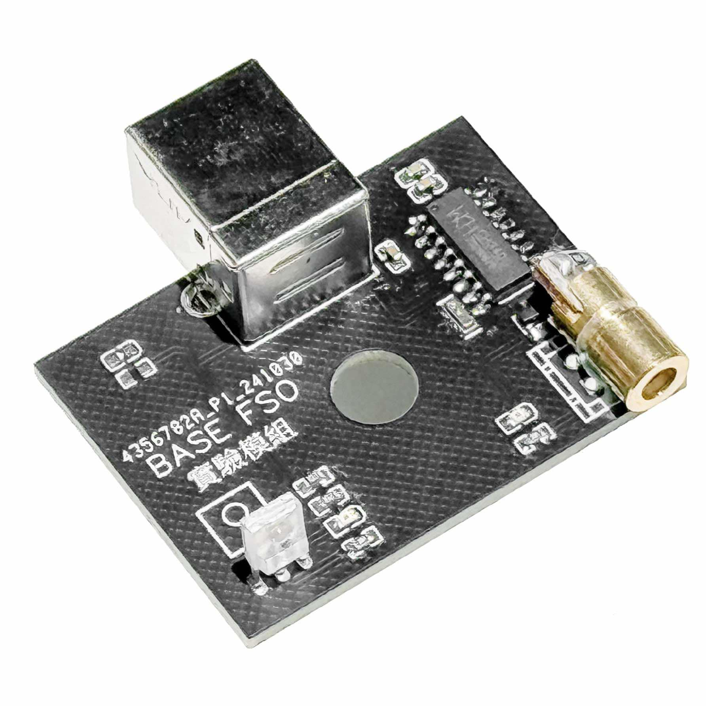

# Free Space Optical Communication

A demonstration program for exploring free-space optical communication using laser transmitter and receiver modules. This project showcases the practical implementation of laser-based data transmission between devices.

## Description

This project demonstrates the fundamental concepts of free-space optical communication through a practical implementation using laser modules. The system enables bidirectional communication between two devices using laser light as the transmission medium.

## Features

- Real-time laser-based communication
- Bidirectional message transmission
- Simple USB connectivity
- User-friendly interface

## Getting Started

### Prerequisites

- Computer with available USB port
- Laser communication module kit
- Compatible operating system (Windows)

### Installation

1. Download the latest release from the [Laser Communication Repository](https://github.com/arichman1209/Laser_Communication)
2. Extract the files to your preferred location

## Usage

1. Connect the laser communication module to your computer using the provided USB cable
2. Launch the application
3. Select the correct COM port from the dropdown menu
4. Click the "Connect" button to establish connection
5. Carefully align your laser transmitter with the receiver of the second device
6. Start sending messages through the interface
7. Messages from the other device will appear automatically in your receive window

## Hardware Setup

Ensure proper alignment between devices:
- Keep devices steady and on the same horizontal plane
- Maintain clear line of sight
- Optimal distance range: undder 1 meter
- Avoid bright ambient light for best results

## Safety Notes

- Never point lasers at eyes or reflective surfaces
- Keep devices away from children
- Follow all local regulations regarding laser device usage
- Use in well-ventilated areas
---
Developed by BaseTech
-

